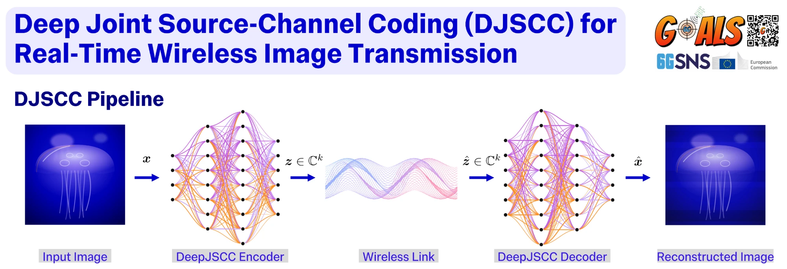
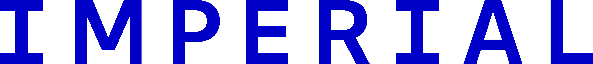

<div align="center">
  
</div>

<div align="center">
  
</div>

<p align="center">
  
  
  
  
  
</p>

✍️ **Authors:** Marcello Bullo, Meng Hua

🖇️ **Contact:** m.bullo21@imperial.ac.uk (bullo.marcello@gmail.com), m.hua@imperial.ac.uk

📹 **Original demo video (EuCNC):** https://zenodo.org/records/20402945

---

# DJSCC Playground

A **real-channel testbed for over-the-air image transmission** with Deep Joint
Source-Channel Coding (DJSCC), together with a conventional Separate
Source-Channel Coding (SSCC) baseline (JPEG/JPEG2000 + LDPC).

The defining feature: **the encoder/decoder model is picked at runtime.** You can
pass a HuggingFace repo id, a local folder, a short alias or a raw `.pth`
checkpoint, and you never edit the transmit/receive code.

> This repo grew out of [`djscc-demo`](https://github.com/marcellobullo/djscc-demo),
> which is frozen as the EuCNC release. The physical layer (GNU Radio OFDM + USRP)
> and the ZMQ link to it are the same. What changed is the model layer, which is
> now pluggable, and the repo adds training, semantic aligners and experiment
> tooling.

## Table of contents

- [Highlights](#highlights)
- [Architecture](#architecture)
- [Repository layout](#repository-layout)
- [Installation](#installation)
- [Running over the air](#running-over-the-air)
  - [DJSCC mode](#djscc-mode)
  - [SSCC mode (conventional baseline)](#sscc-mode-conventional-baseline)
  - [Bench test without radios](#bench-test-without-radios)
- [SNR-sweep experiments](#snr-sweep-experiments)
- [Training](#training)
- [Semantic aligners](#semantic-aligners)
- [Publishing a model to HuggingFace](#publishing-a-model-to-huggingface)
- [Adding your own model](#adding-your-own-model)
- [Physical-layer reference](#physical-layer-reference)
- [Troubleshooting](#troubleshooting)

## Highlights

- 🔌 **Pick the model at runtime.** `--model` takes an HF id, an HF folder, an alias or a `.pth` file.
- 🧠 **Several DJSCC families:**
  - a ConvNeXt DJSCC with a channel-blind encoder and a FiLM-conditioned CSI decoder
  - a *spatial-CSI* variant that removes banding artifacts
  - attention-based **ADJSCC** (SNR-adaptive)
  - the **Bourtsoulatze-2019** DeepJSCC baseline
- 🔁 **Semantic aligners.** Pair *any* TX encoder with *any* RX decoder through a small learned adapter.
- 📡 **Real RF link.** GNU Radio 3.10 OFDM over USRP at 2.45 GHz, with a robust packet header, live SNR telemetry and optional 2×2 MIMO flowgraphs.
- 📉 **Live CSI.** The receiver estimates SNR from pilots and null subcarriers and passes it to CSI-aware decoders.
- 🏋️ **One training script for every model.** It runs on AWGN, Rayleigh, Rician or OFDM multipath channels, with random SNR and random packet drops, and supports perceptual losses.
- 📊 **Experiment tooling.** Scripts for per-SNR TX/RX runs and PSNR-vs-SNR plots.

## Architecture

```
                model selected at runtime (HF id | folder | alias | .pth)
                                     │
                          jscc.load_codec(...)            jscc.load_aligner(...)
                                     │                            │
                        ┌────────────┴────────────┐   composed at the adapter layer
                        │   BaseCodec adapter     │◀── (any model × any aligner)
                        │  encode / decode / CSI  │
                        └────────────┬────────────┘
                                     │
        socket_tx.py ────────────────┼─────────────── socket_rx.py
              │            ZMQ (cf32 symbols | bytes)         │
        djscc_tx.grc / conventional_tx.grc        djscc_rx.grc / conventional_rx.grc
              │              OFDM + USRP                      │
              └──────────────  real RF link  ─────────────────┘
```

The stack has three layers:

| Layer | Tool | Role |
|-------|------|------|
| **Author / train** | [Kaira](https://github.com/ipc-lab/kaira) | Models are `kaira.models.BaseModel` subclasses composed with `kaira.constraints` / `kaira.channels`. Training runs end-to-end in one process. |
| **Package** | 🤗 HuggingFace | `modeling_*.py` is a `PreTrainedModel` whose config stores the build recipe. `push_to_hub` ships weights + code + config, and `from_pretrained(..., trust_remote_code=True)` rebuilds the model. Loading needs `kaira` installed. |
| **Deploy** | `jscc.BaseCodec` | A thin adapter. It runs `.encode` on the TX host and `.decode` on the RX host. It handles real/complex packing, `packet_len` padding and the CSI tensor, and replaces the simulated channel with the **real USRP link**. Aligners are attached here, never baked into a model. |

**Data flow for one image:** a camera frame or file is resized to 768×512. The
encoder turns it into latent symbols *z ∈ ℂᵏ*, which are power-normalized,
optionally interleaved, and split into packets of 960 complex symbols. Each packet
goes over ZMQ to the GNU Radio TX flowgraph, which does OFDM modulation and sends
it through the USRP. On the RX side, GNU Radio synchronizes and equalizes the
signal, parses the header and forwards the payload symbols (plus a live SNR
estimate) over ZMQ to `socket_rx.py`. That script reassembles the packets
(missing ones are zero-filled), applies the aligner if there is one, and decodes
the image.

## Repository layout

```
jscc/                        the model-agnostic codec layer
  base.py                    BaseCodec / BaseEncoderCodec / BaseDecoderCodec / BaseAligner
  loader.py                  load_codec(model, role) / load_aligner(spec, ...)
  registry.py                short aliases (e.g. "conventional", "djscc-r6")
  channels.py                OFDM multipath channel used for training
  data.py                    image-folder dataset + loaders
  djscc/                     ConvNeXt DJSCC (channel-blind enc + FiLM CSI decoder)
  djscc_spatialcsi/          no-band variant (per-element CSI decoder, anti-banding)
  adjscc/                    attention DJSCC (SNR-adaptive encoder + decoder)
  bourtsoulatze/             Bourtsoulatze-2019 DeepJSCC baseline (fixed-SNR)
  aligners/                  aligner modules + BaseAligner wrapper
  conventional/              SSCC codec stub (output_kind="bytes")  [encode/decode TODO]
transmitter/
  socket_tx.py               unified DJSCC transmitter (any --model)
  socket_conventional_tx.py  SSCC transmitter (JPEG/JPEG2000 + LDPC)
  gnu_radio/                 djscc_tx.grc, conventional_tx.grc, djscc_tx_mimo.grc
receiver/
  socket_rx.py               unified DJSCC receiver (any --model, live SNR)
  socket_conventional_rx.py  SSCC receiver (BP LDPC decoding, soft/hard demap)
  gnu_radio/                 djscc_rx.grc, conventional_rx.grc, djscc_rx_mimo.grc, ...
training/
  train.py                   train/fine-tune any model (Kaira recipe)
  train_aligner.py           train a semantic aligner between two frozen models
  eval_aligner.py            misaligned / aligned / matched evaluation + ARR
scripts/
  export_*_to_hf.py          raw .pth -> AutoModel-loadable HF folder (+ push)
  build_aligners_repo.py     package aligners as an HF repo
  run_{tx,rx}_experiment*.sh per-SNR over-the-air experiment drivers
  plot_snr_psnr.py           SNR-vs-PSNR curves from results/
gr-modules/gr-deepjscc/      GNU Radio OOT module (robust / wide OFDM packet headers)
utils/parity_matrices/       LDPC parity-check matrices (802.11-style n/k pairs)
checkpoints/                 local weights (gitignored)
```

## Installation

1. **Clone the repository**
   ```bash
   git clone https://github.com/marcellobullo/djscc-playground
   cd djscc-playground
   ```

2. **Create the environment.** GNU Radio is easiest to get from conda-forge:
   ```bash
   conda create -y -n demo -c conda-forge python=3.11 gnuradio=3.10 uhd cmake pybind11
   conda activate demo
   ```
   *(Tested with Python 3.11 and GNU Radio 3.10.12. Other versions are untested.)*

3. **Install the Python dependencies**
   ```bash
   pip install -r requirements.txt
   ```
   If your version of `kaira` is not on PyPI, install it from
   [ipc-lab/kaira](https://github.com/ipc-lab/kaira).

4. **Build and install the `gr-deepjscc` OOT module.** The flowgraphs need it for
   the OFDM packet headers.
   ```bash
   cd gr-modules/gr-deepjscc
   mkdir -p build && cd build
   cmake -DCMAKE_INSTALL_PREFIX="$CONDA_PREFIX" -DCMAKE_BUILD_TYPE=Release ..
   make -j4 && make install
   cd ../../..
   ```
   Check the install with `python scripts/verify_header_robust.py`. It round-trips
   the header through the generator and parser and checks that bad CRCs are
   rejected.

5. **Get model weights.** Use either option:
   - **HuggingFace (recommended):** pass a repo id such as
     `marcellobullo/djscc-convnext-cr6-ofdm-spatialcsi` to `--model`. It is
     downloaded on first use.
   - **Local checkpoints:** put legacy `.pth` files under `checkpoints/`
     (for example `checkpoints/custom_djscc/compratio-6_latest.pth`). This folder
     is gitignored.

## Running over the air

Each side runs **two processes**: the GNU Radio flowgraph (radio + OFDM) and the
Python socket script (neural or classical codec). Start the **receiver first**,
then the transmitter. Every TX/RX option that shapes the signal must match on
both ends: `--model` family, `--comp-ratio`, `--interleave`, `--aligner`, and the
LDPC settings in SSCC mode.

> The USRP IP addresses (`device_address`), carrier frequency and gains are
> variables in the `.grc` files. Edit them in `gnuradio-companion` for your setup,
> or regenerate the `.py` with `grcc`.

### DJSCC mode

#### Receiver (RX)
1. GNU Radio receiver flowgraph:
   ```bash
   python receiver/gnu_radio/djscc_rx.py
   ```
2. Python decoder. It conditions on the live SNR from the flowgraph:
   ```bash
   python receiver/socket_rx.py \
       --model marcellobullo/djscc-convnext-cr6-ofdm-spatialcsi \
       --use-live-snr --interleave
   ```

#### Transmitter (TX)
1. GNU Radio transmitter flowgraph:
   ```bash
   python transmitter/gnu_radio/djscc_tx.py
   ```
2. Python encoder. The source can be the camera, a single file or a folder:
   ```bash
   python transmitter/socket_tx.py \
       --model marcellobullo/djscc-convnext-cr6-ofdm-spatialcsi \
       --source folder --path /path/to/images --interleave
   ```
   With `--source camera`, the default (`--shots 0`) opens an interactive
   **CAPTURE & SEND** button. `--shots N` captures automatically every `--interval` seconds.

**Choosing a model.** You can pass any of these to `--model`:

| Form | Example |
|------|---------|
| HF repo id | `marcellobullo/djscc-convnext-cr6-ofdm-spatialcsi` |
| local HF folder | `ckpts/run/best` |
| alias | `djscc-r6` (see `jscc/registry.py`) |
| raw checkpoint | `checkpoints/custom_djscc/compratio-6_latest.pth --comp-ratio 6` |

For raw `.pth` files, the family is inferred from the filename: `spatialcsi` /
`no_band` selects the spatial-CSI variant, `adjscc` selects ADJSCC, and anything
else falls back to the ConvNeXt DJSCC. SNR-adaptive encoders such as ADJSCC take
a design SNR through `--snr-db`.

**Adding an aligner.** Pass `--aligner <.pth | folder | HF id>` on **both** sides,
for example `--aligner checkpoints/aligners/aligner_conv.pth`.

Useful RX options:

| Option | Effect |
|--------|--------|
| `--count N` | stop after N unique images |
| `--output-dir`, `--name-prefix`, `--no-timestamp`, `--no-save` | control saved reconstructions |
| `--drop-slots`, `--drop-seed` | drop packets on purpose to test erasure robustness |
| `--renorm`, `--clip-mag` | renormalize / clip the received symbols before decoding |

### SSCC mode (conventional baseline)

The classical pipeline uses its own socket scripts and flowgraphs. Source coding
is JPEG or JPEG2000, sized to the same symbol budget as DJSCC at a given
`--comp-ratio`. Channel coding is LDPC, followed by BPSK/QPSK/16QAM mapping. The
LDPC parity matrices for `(n, k)` ∈ {(960, 640), (1920, 960), (2304, 1152),
(2304, 1728), (2304, 1920)} ship in `utils/parity_matrices/`.

#### Receiver (RX)
```bash
python receiver/gnu_radio/conventional_rx.py
python receiver/socket_conventional_rx.py --codec jpeg --bits-per-symbol 2 \
    --ldpc-n 1920 --ldpc-k 960 --bp-iters 10 --demap soft --interleave
```

#### Transmitter (TX)
```bash
python transmitter/gnu_radio/conventional_tx.py
python transmitter/socket_conventional_tx.py --codec jpeg --bits-per-symbol 2 \
    --ldpc-n 1920 --ldpc-k 960 --bp-iters 10 --interleave \
    --source folder --path /path/to/images
```

> The flowgraph fixes the modulation order when it is built. If you change
> `--bits-per-symbol`, restart the flowgraph with the matching setting.

### Bench test without radios

To test the codec path without GNU Radio or USRPs, the TX can push PDUs straight
to the RX:

```bash
python receiver/socket_rx.py --model <model> --port 5559
python transmitter/socket_tx.py --model <model> --direct-zmq --source file --path img.png
```

## SNR-sweep experiments

In the lab, a **channel emulator** sets the SNR by hand. The experiment scripts
label each run with that SNR and can also launch the flowgraph for you
(`--launch-fg`). Run one SNR point at a time:

```bash
# RX: receive 24 images at 10 dB  ->  results/snr_10dB/snr10_001.png, ...
scripts/run_rx_experiment.sh 10 --count 24 --results ./results

# TX: transmit the dataset once at the same SNR
scripts/run_tx_experiment.sh 10 --dataset ./dataset
```

Both scripts default to `marcellobullo/djscc-convnext-cr6-ofdm-spatialcsi` with
interleaving on. Use `--model`, `--aligner` and `--no-interleave` to change that,
and put `--` before any extra arguments meant for the socket script. The
`*_conventional.sh` scripts do the same for SSCC and also take `--ldpc-n`,
`--ldpc-k` and `--mod-order`.

Then plot PSNR against channel SNR (images are compared to the Kodak originals):

```bash
python scripts/plot_snr_psnr.py --results results --originals /path/to/kodak
```

## Training

One script trains any model. It loads the architecture from the Hub or a local HF
folder with `AutoModel` and runs this recipe: encoder → power constraint → Kaira
channel (+ optional packet drop) → decoder, with random or fixed SNR. It saves the
result with `save_pretrained`, so the output can be loaded with `AutoModel`
directly. **There is no separate export step:** train, then deploy or
`push_to_hub` the same folder.

```bash
# fine-tune a published model over SNR ~ U[0,20] dB with 10% packet drops
python training/train.py --model marcellobullo/djscc-convnext-cr6-awgn \
    --train-data-dir /data/DIV2K_train_HR --val-data-dir /data/DIV2K_valid_HR \
    --channel awgn --snr-min 0 --snr-max 20 --drop-prob 0.10 \
    --epochs 50 --batch-size 4 --out ckpts/run

# deploy the result immediately (or add --push-to-hub <repo> to the command above)
python receiver/socket_rx.py --model ckpts/run/best --use-live-snr
```

Key options:

- `--model`: HF id or local HF folder to start from. Add `--reinit` to train from
  scratch with the same architecture and random weights.
- `--channel awgn|rayleigh|rician|ofdm|none`: the training channel. `ofdm` is
  frequency-selective multipath with per-subcarrier equalization (see
  `jscc/channels.py`); the others are Kaira channels. OFDM settings:
  `--ofdm-subcarriers` (set it to the link's `fft_len`), `--ofdm-taps`,
  `--ofdm-decay` and `--ofdm-eq zf|mmse`.
- `--snr-db X` for a fixed SNR, **or** `--snr-min A --snr-max B` to sample the SNR
  from `U[A,B]` for each batch.
- `--drop-prob P`: each packet is dropped independently with probability `P`.
  **Or** use `--drop-min A --drop-max B` to sample the drop rate from `U[A,B]` for
  each batch, so the decoder trains across a range of erasure conditions.
- `--loss <name>`: the training loss (see the table below). Validation always
  reports **PSNR + MS-SSIM + LPIPS**.
- `--resume ckpts/run/last.pth`, `--push-to-hub <repo>`.

`--train-data-dir` and the optional `--val-data-dir` take one or more flat image
folders (DIV2K-style). The model's `config.model_type` decides how the decoder is
conditioned:
- `djscc`: scalar SNR
- `adjscc`: attention SNR
- `djscc_spatialcsi`: per-element CSI map, with dropped packets marked by a sentinel SNR

### Losses

| `--loss`    | Kaira class    | What it optimizes and when to use it |
|-------------|----------------|-------------------------|
| `mse`       | `MSELoss`      | Pixel MSE. Gives the best PSNR and is the default. Tends to blur texture at low rate. |
| `l1`        | `L1Loss`       | Mean absolute error. Sharper than MSE and more robust to outliers. |
| `ssim`      | `SSIMLoss`     | Single-scale structural similarity. |
| `msssim`    | `MSSSIMLoss`   | Multi-scale SSIM. Best perceived structure and MS-SSIM score. |
| `vgg`       | `VGGLoss`      | Perceptual loss in VGG feature space. Lighter than LPIPS. |
| `lpips`     | `LPIPSLoss`    | Learned perceptual loss. Most realistic-looking output, but it can invent texture. |
| `mse_lpips` | `MSELPIPSLoss` | Weighted MSE + LPIPS, for both fidelity and perceptual quality. Set the weights with `--mse-weight` / `--lpips-weight`. |

`--lpips-net alex|vgg|squeeze` (default `alex`) picks the backbone for the LPIPS
*validation metric*. It does not depend on the training loss.

## Semantic aligners

An aligner is a small module applied to the **received latent** on the RX side.
It lets a decoder understand an encoder it was never trained with, for example an
ADJSCC transmitter feeding a ConvNeXt spatial-CSI receiver. Both models stay
frozen and only the aligner is trained.

```bash
python training/train_aligner.py \
    --src-model marcellobullo/adjscc-cr6-awgn \
    --tgt-model ckpts/djscc-convnext-cr6-ofdm-spatialcsi/best \
    --kind conv --channel ofdm --snr-min 0 --snr-max 20 --drop-min 0 --drop-max 0.3 \
    --loss mse_lpips --train-data-dir /data/DIV2K_train_HR \
    --val-data-dir /data/DIV2K_valid_HR --epochs 30 --out ckpts/aligner-adjscc2spatialcsi
```

There are two training objectives:
- `--objective end2end` (default): image-space loss through the frozen decoder.
- `--objective latent`: decoder-free latent matching. It also enables the
  closed-form `--kind linear` (Wiener) and `--kind zeroshot` (SVD) aligners.

Evaluate the aligner on a held-out set. The script compares three cases:
**misaligned** (no aligner), **aligned** and **matched** (the ceiling). It
reports the *Alignment Recovery Ratio*, the share of the gap between misaligned
and matched that the aligner closes:

```bash
python training/eval_aligner.py \
    --src-model marcellobullo/adjscc-cr6-awgn \
    --tgt-model ckpts/djscc-convnext-cr6-ofdm-spatialcsi/best \
    --aligner ckpts/aligner-adjscc2spatialcsi \
    --test-dir /data/kodak --channel ofdm --snr-list 0 10 20 --out-dir eval_out
```

## Publishing a model to HuggingFace

Each model family has an exporter in `scripts/`. It turns a raw `.pth` checkpoint
into a folder that `AutoModel` can load (`config.json` + weights + the bundled
modeling code; loading needs `kaira`) and can push it to the Hub:

| Family | Script | `model_type` |
|--------|--------|--------------|
| ConvNeXt DJSCC (scalar FiLM CSI) | `export_djscc_to_hf.py`            | `djscc` |
| Spatial-CSI / no-band variant    | `export_djscc_spatialcsi_to_hf.py` | `djscc_spatialcsi` |
| Attention SNR-adaptive (ADJSCC)  | `export_adjscc_to_hf.py`           | `adjscc` |
| Bourtsoulatze-2019 baseline      | `export_bourtsoulatze_to_hf.py`    | `deepjscc_b2019` |

```bash
python scripts/export_djscc_to_hf.py \
    --ckpt checkpoints/custom_djscc/compratio-6_latest.pth \
    --out checkpoints/hf/djscc-r6 --comp-ratio 6 \
    --push-to-hub <your-username>/djscc-r6
```

After that, anyone can run `--model <your-username>/djscc-r6` with no code changes.

The Bourtsoulatze baseline has no published checkpoint, so its `--ckpt` is
optional. Without it, the script writes a randomly initialized folder to train
from scratch, and you don't need `--reinit`:

```bash
python scripts/export_bourtsoulatze_to_hf.py --out checkpoints/hf/bourtsoulatze-cr6 --comp-ratio 6
```

## Adding your own model

1. Implement the model as a `PreTrainedModel` + `PretrainedConfig`. Use
   `jscc/djscc/` as a template.
2. Add a `codec_*.py` that exposes `ENCODER_CODEC` / `DECODER_CODEC` (the two
   `BaseCodec` halves), and set `config.codec_module` to it.
3. Call `save_pretrained` on an initialized model once, then train it with
   `python training/train.py --model <that folder> --reinit ...`.
4. `push_to_hub`, then run with `--model <repo>`. You're done.

## Physical-layer reference

| Parameter | Value |
|-----------|-------|
| Carrier frequency | 2.45 GHz |
| Sample rate | 1 MS/s |
| FFT size | 64 (48 data + 4 pilot subcarriers at ±7, ±21) |
| Payload per packet | 960 complex symbols |
| Header | BPSK, `deepjscc.packet_header_ofdm_robust`: packet number + 8-bit CRC; no length field, since the length is always 960 |
| Image size | 768 × 512 (DJSCC, comp. ratio 6) |

| ZMQ endpoint | Direction |
|--------------|-----------|
| `tcp://127.0.0.1:5556` | `socket_tx.py` → `djscc_tx` flowgraph (DJSCC symbols) |
| `tcp://127.0.0.1:5558` | `djscc_rx` flowgraph → `socket_rx.py` (payload PDUs) |
| `tcp://127.0.0.1:5560` | `djscc_rx` SNR loggers → `socket_rx.py` (live SNR; the RX binds) |
| `tcp://127.0.0.1:5557` / `5559` | conventional TX / RX (SSCC); `5559` is also the `--direct-zmq` bench path |

**2×2 MIMO (experimental).** `djscc_tx_mimo.grc` / `djscc_rx_mimo.grc` implement
spatial multiplexing on two USRPs joined by a MIMO cable. The DJSCC stream is
split across the two antennas inside the flowgraph. The header is sent on
antenna 0 and combined with MRC at the RX, and the payload uses a regularized-ZF
2×2 equalizer built from orthogonal LTFs. The socket scripts work unchanged. The
blocks are validated in isolation, but there has been no full over-the-air run yet.

## Troubleshooting

- **The RX gets nothing.** Start the RX side before the TX. Check that the USRP
  `device_address` values in the `.grc` files match your hardware, and that
  `--interleave` is set the same way on both ends.
- **The image is garbled but packets arrive.** The TX and RX models (or aligners)
  don't match, or `--comp-ratio` differs between the two ends.
- **`ModuleNotFoundError: gnuradio.deepjscc`.** The OOT module isn't installed in
  the active environment. Rebuild it as described in [Installation](#installation).
  Several copies of `gr-deepjscc` on one machine can overwrite each other's install.
- **Loading an HF model fails with `trust_remote_code` / `kaira` errors.** Install
  `kaira`. HF repos in this project import it when they load.

## Acknowledgements

This work is supported by the **6G-GOALS** project, funded by the European Union's
Smart Networks and Services Joint Undertaking (SNS JU) under Horizon Europe.
